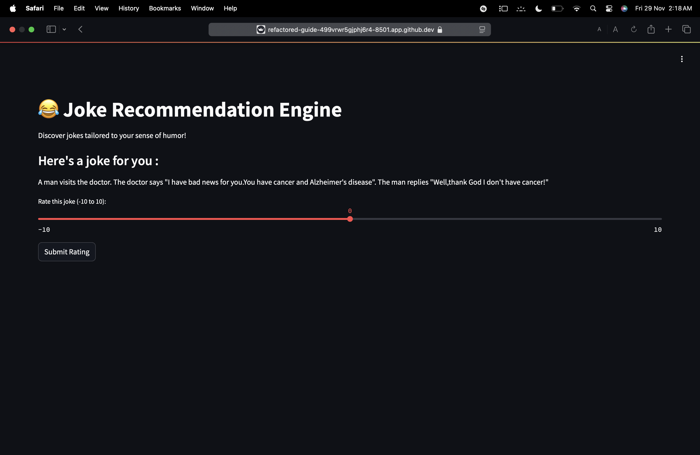
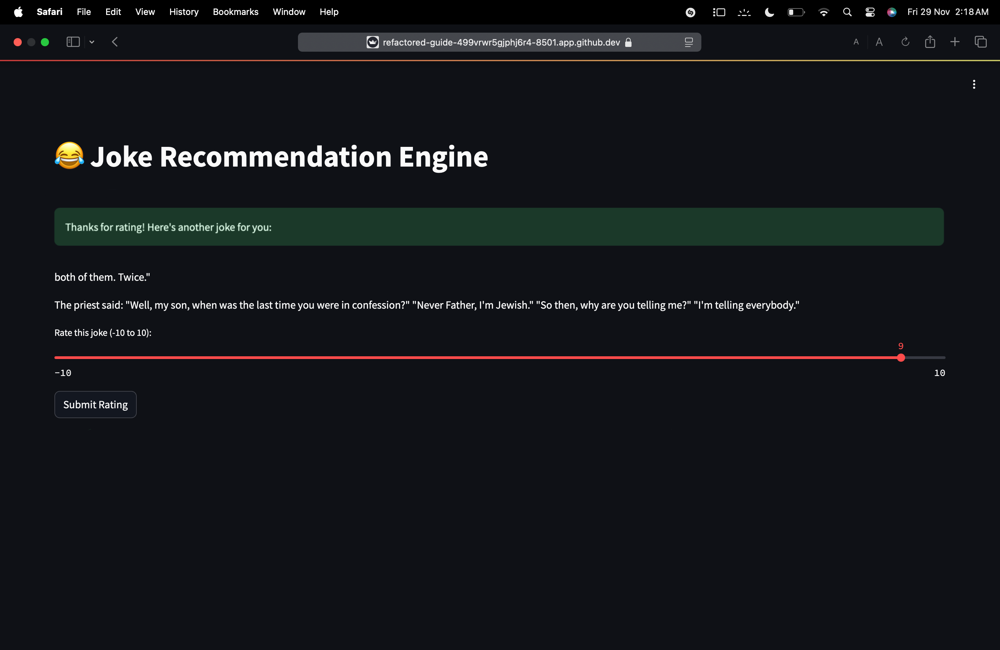

<!DOCTYPE html>
<html lang="en"> 
<head> 
    <meta charset="UTF-8">
    <meta name="viewport" content="width=device-width, initial-scale=1.0">
</head> 
<body>
  
   <h1>Joke Recommendation System</h1>
  <h2>Overview</h2>
    

        The <strong>Joke Recommendation System</strong> is an innovative machine learning-based application designed to recommend personalized jokes to users based on their previous interactions with jokes. The system uses collaborative filtering to analyze user preferences and suggest jokes that a user is likely to enjoy. The underlying model is built using the <strong>Surprise</strong> library, a Python package for building and analyzing recommender systems. The app is built using <strong>Streamlit</strong>, a web framework for creating interactive web applications with Python.
    

    

        This project aims to provide a fun and interactive experience by suggesting jokes tailored to individual users based on their ratings, providing them with an endless stream of humor!
    

  <h2>Features</h2>
    <ul>
        <li><strong>Personalized Recommendations</strong>: Recommends jokes based on users' previous ratings of jokes.</li>
        <li><strong>Collaborative Filtering</strong>: Uses collaborative filtering for creating user-item interaction matrices and predicting ratings for unseen jokes.</li>
        <li><strong>Streamlit Interface</strong>: A simple, clean, and user-friendly interface to interact with the recommendation engine.</li>
        <li><strong>Model Serialization</strong>: The trained recommendation model is saved as a <code>pickle</code> file, allowing easy deployment and reuse.</li>
    </ul>

  <h2>Technologies Used</h2>
    <ul>
        <li><strong>Python</strong>: The core programming language for the implementation.</li>
        <li><strong>Scikit-Surprise</strong>: A Python library for building recommendation systems. It provides collaborative filtering algorithms and tools to train, evaluate, and make predictions on recommender models.</li>
        <li><strong>Streamlit</strong>: A Python-based framework to create beautiful and interactive web applications with minimal effort.</li>
        <li><strong>Pickle</strong>: Used for serializing the trained machine learning model into a file (<code>joke_recommendation_model.pkl</code>) for future use.</li>
        <li><strong>Pandas</strong>: For data manipulation and handling.</li>
        <li><strong>Numpy</strong>: Used for numerical operations in the recommendation system.</li>
        <li><strong>HTML & CSS</strong>: For customizing the appearance of the Streamlit app to make it more user-friendly.</li>
    </ul>

    <h1>Screenshots</h1>
    
    
    
Discover personalized jokes tailored to your sense of humor using machine learning!

  <h2>Dataset</h2>
    

        The dataset used for training the recommendation model contains user ratings for various jokes. The dataset is structured as follows:
    

    <ul>
        <li><strong>JokeId</strong>: Unique identifier for each joke.</li>
        <li><strong>UserId</strong>: Unique identifier for each user.</li>
        <li><strong>Rating</strong>: The rating given by the user for the corresponding joke (range: -10-10).</li>
    </ul>

   <h2>Installation</h2>
    <ol>
        <li><strong>Clone the Repository</strong>: To get started, clone the repository to your local machine:
            <pre><code>git clone https://github.com/SHRISH01/Collaborative-Filtering-Based-Recommendation-Engine.git</code></pre>
        </li>
        <li><strong>Create and Activate a Virtual Environment</strong>: It is recommended to use a virtual environment to manage dependencies:
            <pre><code>python -m venv env
source env/bin/activate  # For Linux/MacOS
.\env\Scripts\activate   # For Windows</code></pre>
        </li>
        <li><strong>Install Dependencies</strong>: Install the required dependencies using pip:
            <pre><code>pip install -r requirements.txt</code></pre>
            The <code>requirements.txt</code> includes all necessary packages such as <code>scikit-surprise</code>, <code>pandas</code>, <code>numpy</code>, <code>streamlit</code>, etc.
        </li>
    </ol>
  <h2>Running the App</h2>
    

        Once the dependencies are installed, you can run the Streamlit app locally:
    

    <pre><code>streamlit run app.py</code></pre>
    

        This will start the app in your default web browser, and you can begin interacting with the recommendation system.
    

   <h2>Model Training</h2>
    
The recommendation model is built using <strong>Collaborative Filtering</strong> with <strong>Matrix Factorization</strong>. The <code>scikit-surprise</code> library's <strong>SVD</strong> (Singular Value Decomposition) algorithm is used to train the model. Once the model is trained, it is saved as a <code>pickle</code> file, which can be loaded to make predictions on new user interactions.

    

        To retrain the model, use the following code:
    

    <pre><code>from surprise import SVD, Dataset, Reader
from surprise.model_selection import train_test_split
import pickle</code></pre>
    
Model Binding

    <pre><code>model = SVD()
model.fit(trainset)</code></pre>
    
Model Saving

    <pre><code>with open('joke_recommendation_model.pkl', 'wb') as file:
        pickle.dump(model, file)</code></pre>
   <h2>Usage</h2>
    <h3>How to Get Recommendations</h3>
    <ol>
        <li><strong>Rate a Joke</strong>: Once the app is running, you will be prompted to rate a joke on a scale of -10 to 10.</li>
        <li><strong>Get Personalized Recommendations</strong>: Based on your rating, the system will recommend a set of jokes that are predicted to be of interest to you.</li>
        <li><strong>Explore Jokes</strong>: You can continue interacting with the system by rating more jokes and receiving updated recommendations.</li>
    </ol>
  <h2>Contributing</h2>
    
 Feel free to fork the repository and contribute. You can submit bug fixes, new features, or improvements through pull requests. Ensure to follow proper coding standards and write tests for new functionality.

    <h2>License</h2>
    
This project is licensed under the MIT License - see the <code>LICENSE</code> file for details.

   <h2>Acknowledgments</h2>
    <ul>
        <li><strong>Scikit-Surprise</strong> for providing the tools to build the collaborative filtering model.</li>
        <li><strong>Streamlit</strong> for creating an interactive interface with minimal effort.</li>
        <li><strong>Pandas</strong> and <strong>Numpy</strong> for easy data manipulation and handling.</li>
    </ul>
</body>
</html>
